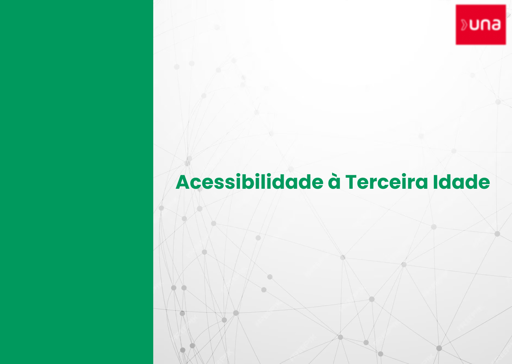

<h1 align="center" id=title> 👴 App - Acessibilidade à Terceira Idade  

 

  

<h2 id=descricao>📜 Descrição</h2>

 Projeto de atendimento/acessibilidade virtual para a terceira idade;
 Este projeto foi feito para atender uma solicitação de um grupo de estudantes da Universidade UNA para os graduandos de T.I da mesma universidade.

<h2 id=video> 🎥 Vídeo Do Projeto </h2>

Neste <a href="https://drive.google.com/file/d/1VwJUg1iO2yKU9bNdN_Tls6cJbfpxBwX2/view?usp=sharing" target="_blank">link</a> é apresentado as finalidades do projeto e como ele irá funcionar.

<h2 id=tecnologias>💻 Tecnologias</h2>

As tecnologias que foram utilizadas neste projeto são as seguintes: 

- <a href="https://www.figma.com/file/A3786rgh4dnIms0ZBGMN8B/Untitled?type=design&node-id=151%3A15&mode=design&t=U48Vi431cARgTL3x-1">FIGMA</a>
- <a href="https://developer.mozilla.org/pt-BR/docs/Web/HTML">HTML</a>
- <a href="https://developer.mozilla.org/pt-BR/docs/Web/CSS">CSS</a>
- <a href="https://developer.mozilla.org/pt-BR/docs/Web/JavaScript">JS</a>
- <a href="https://laravel.com/">LARAVEL</a>
- <a href="https://webrtc.org/?hl=pt-br">WEBRTC</a>
- <a href="https://www.mysql.com/">MYSQL</a>

<h2 id=autores>👨‍🎓 Autores</h2>

Os desenvolvedores deste projeto foram os seguintes:

- <a href="https://github.com/Bernardo-Marconi" target="_blank">Bernardo Marconi</a> 
- <a href="https://github.com/ocai0" target="_blank">Caio Fernandes</a> 
- <a href="https://github.com/Lucasos8" target="_blank">Lucas Souza</a> 
- <a href="" target="_blank">Phillipe Rodrigues</a> 
- <a href="https://github.com/renzzorocha" target="_blank">Renzzo Rocha</a> 

